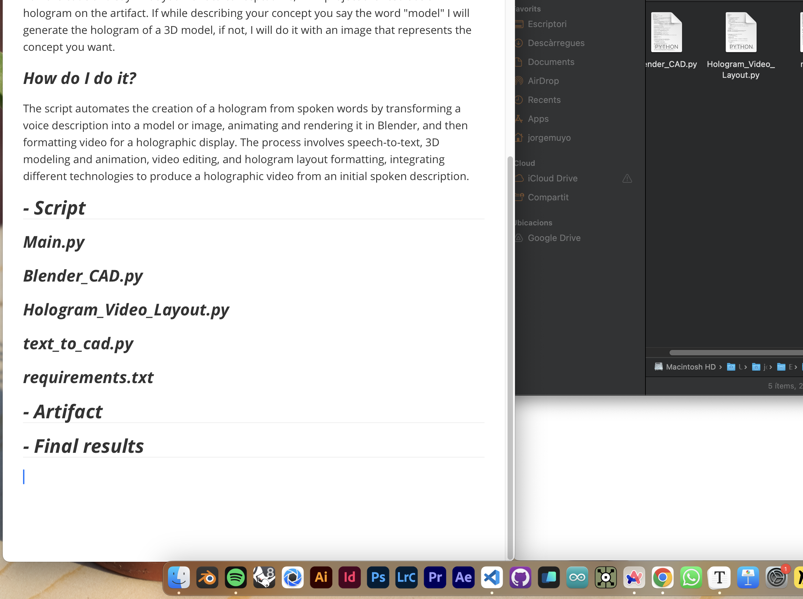

# AI-generated-holograms

###### ***Vania Bisbal - Jorge Muñoz***

----
## - About

### *What am I?*

I am a design assistant for both creatives and non-creatives that helps imagine and visualizing concepts.

### *What do I do?*

Run the code and say what you want to conceptualize, I will project the result as a hologram on the artifact. If while describing your concept you say the word "model" I will generate the hologram of a 3D model, if not, I will do it with an image that represents the concept you want.

### *How do I do it?*

The script automates the creation of a hologram from spoken words by transforming a voice description into a model or image, animating and rendering it in Blender, and then formatting video for a holographic display. The process involves speech-to-text, 3D modeling and animation, video editing, and hologram layout formatting, integrating different technologies to produce a holographic video from an initial spoken description.

### *What will YOU need to make this work?*

- **For the code:** 
  - *Blender installed on your computer:* This code has been running on [Blender 4.0](https://www.blender.org/) for Mac on macOS Sonoma 14.4 
  - OpenAI keys: To have acces to [OpenAI API](https://platform.openai.com/) and be able to use their models
  - kittycad keys: To be able to generate AI 3D models using [ZOOCAD](https://zoo.dev/pricing) model
- **For the artifact:** 
  - Laser cut machine: To be able to cut the pieces of the structure
  - 3 sheets (100x60) of 4mm plywood: For the base and the bottom of the structure
  - 1 sheet (100x60) of 4mm methacrylate: For the columns and the pyramid
  - Screen: The plans of the artifact are measured for a 30x26 cm screen. Be aware that as brighter the screen is a much better result you'll get. 

## - Code

### *Main.py*

This will be the main script that will control everything else. The script consists of three different parts. 

- **Speech recognizer:** Will record the audio of the user asking for the desired object for inspiration, then will print the recorded audio to text and will assign it as the prompt.


  ```python
  recognizer = sr.Recognizer()
  # Record a audio and get text
  with sr.Microphone() as source:
  	print("Say something!")
  	audio = recognizer.listen(source, 3, 8) # 3: Number of seconds listening until something is detected, 8: Number of seconds listening
      
  audio_transcription = recognizer.recognize_google(audio)
  print(audio_transcription)
  ```

- **if model in text:** Once ```audio_transcription``` is defined, the script will look for the word ```model``` inside the transcription. If it's not inside, it will execute the first part of the condition, where we will use dall-e-3 to generate images as the user didn't ask for a model. 

  ```python
  Open_AI_prompt ="add a black background"
  
  complete_prompt = audio_transcription + " and " + Open_AI_prompt
  ```

  Remember to use short prompts in ```Open_AI_prompt``` as the results will be significantly better. 

  In this piece of code you will be able to modify the number of images, quality, proportion, prompt and the image generator for the images:
  
  ```python
      response = openAI_client.images.generate(
          model="dall-e-3",
          prompt=complete_prompt,
          size="1024x1024",
          quality="standard",
          n=1,
      )
  ```
  
  OpenAI will generate a url to see the image that the script will automatically download using ```requests``` library. 
  
  After that, a static video of the image will be created using ```moviepy.editor```  where the duration can be specified ```video_duration = 20``` . Lastly, the script will wait for the video to be ready before opening ```Hologram_Video_Layout.py``` so it doesn't give the user an error. Using the following definition, the script will check if the file created with the ```moviepy.editor``` is still having changes in size (What will mean the process of creating it won't be fully done)
  
  ```python
      def file_modification_stable(file_path, stability_duration=60, check_interval=40, timeout=3600):
          start_time = time.time()
          last_mod_time = None
          stable_start_time = None
  
          while True:
              if not os.path.exists(file_path):
                  print(f"{file_path} does not exist yet.")
                  last_mod_time = None  
              else:
                  current_mod_time = os.path.getmtime(file_path)
                  if last_mod_time is None or current_mod_time != last_mod_time:
                      last_mod_time = current_mod_time
                      stable_start_time = time.time()  
                  elif time.time() - stable_start_time >= stability_duration:
                      print(f"File {file_path} has been stable for {stability_duration} seconds.")
                      break
  
              if time.time() - start_time > timeout:
                  print("Timed out waiting for file to become stable.")
                  break
  
              time.sleep(check_interval)
  ```
  
  User will be able to determine the amount of time the script waits until checking, the time of stability and the time the definition will be running until stoping.
  
  After this, when the file is stable, the script ```Hologram_Video_Layout.py``` will be opened.
  
  ```python
  def run_python_script(script_path):
          print(f"Running script {script_path}...")
          subprocess.run(["python", script_path], check=True)
  
  
  
      file_path = '/Users/jorgemuyo/Desktop/Challenge/rendered_blender_video.mp4'
      script_path = '/Users/jorgemuyo/Desktop/Challenge/Hologram_Video_Layout.py'
      # Wait for the file to finish rendering and for the file modification time to be stable
      file_modification_stable(file_path)
  
      # Once the file is stable, run another script
      run_python_script(script_path)
  ```

- **else:** This part of the script will be executed if the user says ```model``` in ```audio_transcription``` 

### *Blender_CAD.py*


### *Hologram_Video_Layout.py*
### *text_to_cad.py*
### *requirements.txt*

## - Artifact

## - Final results


