# AI-generated-holograms

###### **[Vania Bisbal](https://vania-bisbal.github.io/repo-website/) - [Jorge Muñoz](https://jmuozan.github.io/jorgemunyozz.github.io/index.html)**

----
## - About

### *What am I?*

I am a design assistant for both creatives and non-creatives that helps imagine and visualizing concepts.

### *What do I do?*

Run the code and say what you want to conceptualize, I will project the result as a hologram on the artifact. If while describing your concept you say the word "model" I will generate the hologram of a 3D model, if not, I will do it with an image that represents the concept you want.

### *How do I do it?*

The script automates the creation of a hologram from spoken words by transforming a voice description into a model or image, animating and rendering it in Blender, and then formatting video for a holographic display. The process involves speech-to-text, 3D modeling and animation, video editing, and hologram layout formatting, integrating different technologies to produce a holographic video from an initial spoken description.

### *What will YOU need to make this work?*

- **For the code:** 
  - *Blender installed on your computer:* This code has been running on [Blender 4.0](https://www.blender.org/) for Mac on macOS Sonoma 14.4 
  - OpenAI keys: To have acces to [OpenAI API](https://platform.openai.com/) and be able to use their models
  - kittycad keys: To be able to generate AI 3D models using [ZOOCAD](https://zoo.dev/pricing) model
- **For the artifact:** 
  - Laser cut machine: To be able to cut the pieces of the structure
  - 3 sheets (100x60) of 4mm plywood: For the base and the bottom of the structure
  - 1 sheet (100x60) of 4mm methacrylate: For the columns and the pyramid
  - Screen: The plans of the artifact are measured for a 30x26 cm screen. Be aware that as brighter the screen is a much better result you'll get. 
## - Initial Idea

The initial idea of the AI-generated-holograms project was to create a design assistant capable of transforming spoken descriptions into visual holographic representations. The goal was to develop a system that could take a user’s voice input, interpret the description, and generate either a 3D model or an image. This would then be projected as a hologram, allowing users to visualize their concepts in a tangible, interactive format. The project aims to bridge the gap between abstract ideas and concrete visualizations, providing a tool for creatives and non-creatives to better express and refine their ideas.

## - Definition of Intellingence (Customer Definition) 

In this project, intelligence means the system's ability to turn spoken language into meaningful visual displays accurately. This includes understanding the details of what the user says, choosing whether a 3D model or a 2D image is better, and then using advanced technology to create and show the hologram. We measure the system's intelligence by how well it understands the user, the quality of the visuals it creates, and how smoothly it combines different technologies to produce a clear hologram.

## - Research References and Resources

[DIY HOLOGRAMS 1](https://youtu.be/QPM1LwEzzwU?si=lN1u0pyrpN2pjjYs)

[DIY HOLOGRAMS 2](https://youtu.be/aTB2ryoWIFU?si=VgQ2FmUnEJ8aMZJG)

[Disney Hologram Article](https://www.latimes.com/entertainment-arts/story/2023-02-15/disney-unveils-hologram-walt-disney-disney-100)

[Pepper's Ghost Illusion](https://www.twowaymirrors.com/peppers-ghost-illusion/)

[Blender](https://www.blender.org/)

[OpenAI](https://platform.openai.com/)

[ZOOCAD Pricing](https://zoo.dev/pricing)

[Modmatrix Repo](https://github.com/chris-ernst/modmatrix-ai)

## - Game Plan

1. **Research Phase**:

- Study existing methods of generating holograms and voice-to-text technologies.

2. **Design Phase**:

- Design the overall system architecture, integrating voice recognition, 3D modeling, and holographic projection.
- Sketch the artifact and create initial prototypes using CAD software.

3. **Development Phase**:

- Develop the main script (Main.py) to handle voice recognition, image/model generation, and video processing.
- Create additional scripts for Blender automation (Blender_CAD.py) and hologram video layout (Hologram_Video_Layout.py).

4. **Artifact Construction Phase**:

- Use laser cutting to fabricate the components (CAD creation done before) of the hologram display artifact.
- Assemble the artifact using plywood and methacrylate, ensuring precise measurements for optimal holographic projection.

5. **Integration Phase**:

- Integrate the software with the physical artifact, testing the workflow from voice input to holographic output.
- Debug (a lot) and optimize the system for smooth operation and visual output.

6. **Testing and Iteration Phase**:

- Make necessary adjustments to the scripts and artifact design based on feedback and errors.

7. **Finalization Phase**:

- Document the entire process, including code comments and guidelines.

8. **Presentation and Reflection Phase**:

- Prepare a presentation to showcase (Design Dialogues II) the project.
- Reflect on the project's outcomes.

## - Code

### *Main.py*

This will be the main script that will control everything else. The script consists of three different parts. 

- **Speech recognizer:** Will record the audio of the user asking for the desired object for inspiration, then will print the recorded audio to text and will assign it as the prompt.


  ```python
  recognizer = sr.Recognizer()
  # Record a audio and get text
  with sr.Microphone() as source:
  	print("Say something!")
  	audio = recognizer.listen(source, 3, 8) # 3: Number of seconds listening until something is detected, 8: Number of seconds listening
      
  audio_transcription = recognizer.recognize_google(audio)
  print(audio_transcription)
  ```

- **if model in text:** Once ```audio_transcription``` is defined, the script will look for the word ```model``` inside the transcription. If it's not inside, it will execute the first part of the condition, where we will use dall-e-3 to generate images as the user didn't ask for a model. 

  ```python
  Open_AI_prompt ="add a black background"
  
  complete_prompt = audio_transcription + " and " + Open_AI_prompt
  ```

  Remember to use short prompts in ```Open_AI_prompt``` as the results will be significantly better. 

  In this piece of code you will be able to modify the number of images, quality, proportion, prompt and the image generator for the images:
  
  ```python
      response = openAI_client.images.generate(
          model="dall-e-3",
          prompt=complete_prompt,
          size="1024x1024",
          quality="standard",
          n=1,
      )
  ```
  
  OpenAI will generate a url to see the image that the script will automatically download using ```requests``` library. 
  
  After that, a static video of the image will be created using ```moviepy.editor```  where the duration can be specified ```video_duration = 20``` . Lastly, the script will wait for the video to be ready before opening ```Hologram_Video_Layout.py``` so it doesn't give the user an error. Using the following definition, the script will check if the file created with the ```moviepy.editor``` is still having changes in size (What will mean the process of creating it won't be fully done)
  
  ```python
      def file_modification_stable(file_path, stability_duration=60, check_interval=40, timeout=3600):
          start_time = time.time()
          last_mod_time = None
          stable_start_time = None
  
          while True:
              if not os.path.exists(file_path):
                  print(f"{file_path} does not exist yet.")
                  last_mod_time = None  
              else:
                  current_mod_time = os.path.getmtime(file_path)
                  if last_mod_time is None or current_mod_time != last_mod_time:
                      last_mod_time = current_mod_time
                      stable_start_time = time.time()  
                  elif time.time() - stable_start_time >= stability_duration:
                      print(f"File {file_path} has been stable for {stability_duration} seconds.")
                      break
  
              if time.time() - start_time > timeout:
                  print("Timed out waiting for file to become stable.")
                  break
  
              time.sleep(check_interval)
  ```
  
  User will be able to determine the amount of time the script waits until checking, the time of stability and the time the definition will be running until stoping.
  
  After this, when the file is stable, the script ```Hologram_Video_Layout.py``` will be opened.
  
  ```python
  def run_python_script(script_path):
          print(f"Running script {script_path}...")
          subprocess.run(["python", script_path], check=True)
  
  
  
      file_path = '/Users/jorgemuyo/Desktop/Challenge/rendered_blender_video.mp4'
      script_path = '/Users/jorgemuyo/Desktop/Challenge/Hologram_Video_Layout.py'
      # Wait for the file to finish rendering and for the file modification time to be stable
      file_modification_stable(file_path)
  
      # Once the file is stable, run another script
      run_python_script(script_path)
  ```

- **else:** This part of the script will be executed if the user says ```model``` in ```audio_transcription```.

   If the user asks for a model, the script will use ZOOCAD to generate an ```.stl``` file. 

  ***Common error:** Sometimes the script will give an error ```An error occurred: argument of type 'NoneType' is not iterable``` if that's the case, delete create a file called ```ZOOCAD.stl``` in the output folder. 

  Once created the file, the script will open blender.

  ```python
  path_to_blender = "/Users/jorgemuyo/Desktop/Challenge/Blender_CAD.blend"
  subprocess.run(["open", path_to_blender])
  ```

  Blender will start running the script ```Blender_CAD.py``` rendering the scene while ```main.py``` keeps getting executed. For that reason, the definition ```open_file``` will wait until the mp4 rendering output weighs more than 0 mb.
  ```python
  def open_file(path):
          subprocess.call(['open', path])
          while True:
              if os.path.exists(file_path):
                  if os.path.getsize(file_path) > 0:  
                      print(f"{file_path} found and not empty, opening file...")
                      open_file(file_path)
                      break  
                  else:
                      print(f"{file_path} exists but is empty. Waiting for file to be populated...")
              else:
                  print(f"Waiting for {file_path} creation.")
                  time.sleep(40)
  ```
  
  Once the file is ready, once again ```Hologram_Video_Layout.py``` will get executed and the script will wait for the file to be ready using again ```file_modification_stable``` and ```run_python_script```. At the end, the video will run itself.
  
  ```python
  open_file(path_to_video)
  ```

### *Blender_CAD.py*

To automate Blender once it's automatically open by ```main.py``` we will use blender scripting, based on python. 

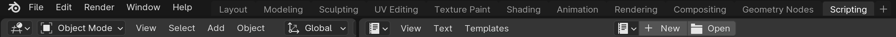

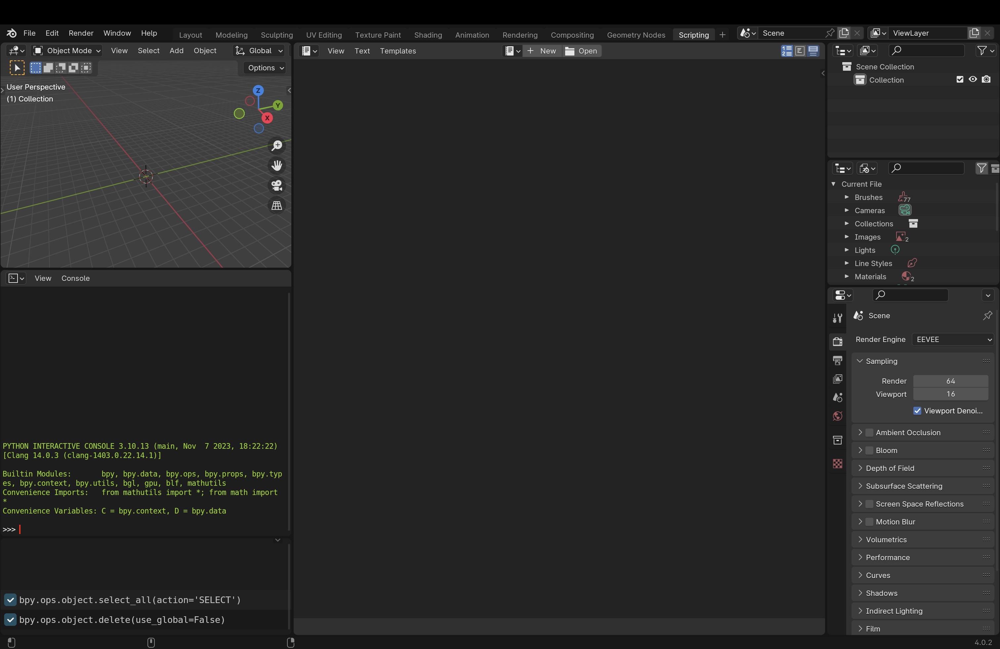

On the right side window you will be able to write your python script. To control Blender with python you'll always need to import the library ```bpy``` All the documentation on how to use the following library can be found [here👈](https://docs.blender.org/api/current/index.html) 

***Notes before starting coding in Blender:** To have automatically loaded once Blender is started you'll need to have them assigned to a Blender file ```.blend``` in this repo we added ```Blender_CAD.blend``` where the script is already loaded. In case it doesn't work or you want to add a new one you'll have to do it form the scripting tab > text > \- [x] Register. 

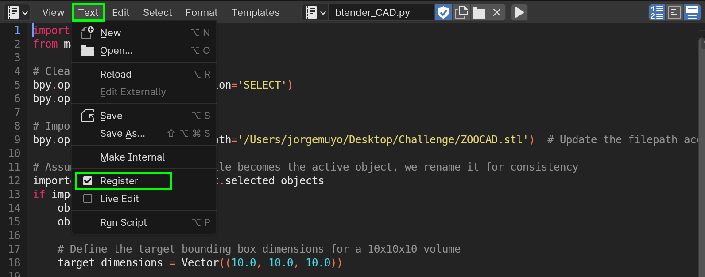

The code will create a simple animation of with the ai created model adding a material and a spin. 

***Problem importing:** the first part of the code will, on one side clear the scene by selecting all the objects and deleting them and then importing the ```.stl``` generated file. If you get a similar error to the following:

```shell
Python: Traceback (most recent call last):
  File "/blender_CAD.py", line 9, in <module>
  File "/Applications/Blender.app/Contents/Resources/4.0/scripts/modules/bpy/ops.py", line 109, in __call__
    ret = _op_call(self.idname_py(), kw)
RuntimeError: Error: Python: Traceback (most recent call last):
  File "/Applications/Blender.app/Contents/Resources/4.0/scripts/addons/io_mesh_stl/__init__.py", line 128, in execute
    tris, tri_nors, pts = stl_utils.read_stl(path)
  File "/Applications/Blender.app/Contents/Resources/4.0/scripts/addons/io_mesh_stl/stl_utils.py", line 251, in read_stl
    with open(filepath, 'rb') as data:
FileNotFoundError: [Errno 2] No such file or directory: '/Users/jorgemuyo/Desktop/Challenge/ZOOCAD.stl'
Location: /Applications/Blender.app/Contents/Resources/4.0/scripts/modules/bpy/ops.py:109

```

Try add 'r' before your path ```r'/your/path/here'```.

As the object size varies drastically in the current state of ZOOCAD, the script tries to solve it by scaling all the objects to a bounding box where the user will be able to change the size to the desired one. In our case we created a 10x10x10 cube.

```python
target_dimensions = Vector((10.0, 10.0, 10.0))
```

Once the object is scaled to the desired volume, the code will move it to the world center.

```python
obj.location = (0, 0, 0)
```

After this the first thing to add is the lighting. In this case we opted for a two point lighting set up, one from the top and the other one from the side. The setup will look something like this:

```python
# Adding lights
    bpy.ops.object.light_add(type='POINT', location=(0, 0, 10))
    top_light = bpy.context.object
    top_light.data.energy = 2000  # Light intensity

    bpy.ops.object.light_add(type='POINT', location=(0, -10, 5))
    back_light = bpy.context.object
    back_light.data.energy = 1000  # Light intensity
    back_light.rotation_euler = (0.785398, 0, 0)
```

With the lights ready we set up a simple animation of the object spinning 360 degrees on the z axis.

```python
# Animation
    bpy.context.scene.frame_start = 1
    start_frame = 1
    bpy.context.scene.frame_end = 250
    end_frame = 250

    obj.rotation_euler = (0, 0, 0)
    obj.keyframe_insert(data_path="rotation_euler", frame=start_frame)
    obj.rotation_euler = (0, 0, 3.14159 * 2) 
    obj.keyframe_insert(data_path="rotation_euler", frame=end_frame)

    fcurves = obj.animation_data.action.fcurves
    for fcurve in fcurves:
        for keyframe_point in fcurve.keyframe_points:
            keyframe_point.interpolation = 'BEZIER'

```

To change the smoothness of the animation we added the 'BEZIER' interpolation so it's not a linear movement. This can be simply changed by adding 'LINEAR' instead of 'BEZIER'. 

***Important note:** The rotation is specified in radians not degrees, for that reason you'll see in the code  ```3.14159 * 2``` which means *2PI = 360 degrees*

For the material we decided to add a procedural material that changes as the animation does, scaling the noise textures added on each keyframe of the animation. You can change the color on the following line:

```python
    colorramp_node.color_ramp.elements[0].color = (1, 0, 0, 1)  # RED
    colorramp_node.color_ramp.elements[1].color = (0, 0, 1, 1)  # BLUE
```

Lastly, after adding a camera were the position, focus and rotation is fully controlable, we added the rendering setup. Where the codec, format, quality, proportion, resolution and fps are fully controllable. If you're interested in generating the holograms by using all our code I would recommend not to change neither the encoder and the output format or the proportion as it will affect ```Hologram_Video_Layout.py``` execution.

```python
bpy.context.scene.render.filepath = '/Users/jorgemuyo/Desktop/Challenge/rendered_blender_video.mp4' 
    bpy.context.scene.render.image_settings.file_format = 'FFMPEG'
    bpy.context.scene.render.ffmpeg.format = 'MPEG4'
    bpy.context.scene.render.ffmpeg.codec = 'H264'
    bpy.context.scene.render.ffmpeg.constant_rate_factor = 'MEDIUM'
    bpy.context.scene.render.resolution_x = 2500
    bpy.context.scene.render.resolution_y = 2500
    bpy.context.scene.render.resolution_percentage = 100
    bpy.context.scene.render.fps = 24
```

The animation won't render automatically unless this last piece of code is added.

```python
bpy.ops.render.render(animation=True)
```

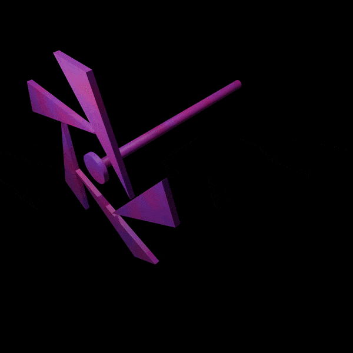

### *Hologram_Video_Layout.py*

The last piece of code that will be executed will be ```Hologram_Video_Layout.py``` to generate the proper layout for hologram uses. As we are using the pepper ghost effect in a pyramid, Our video output should be a video copied and rotated 4 times around the center of the screen all separated the same amount. 

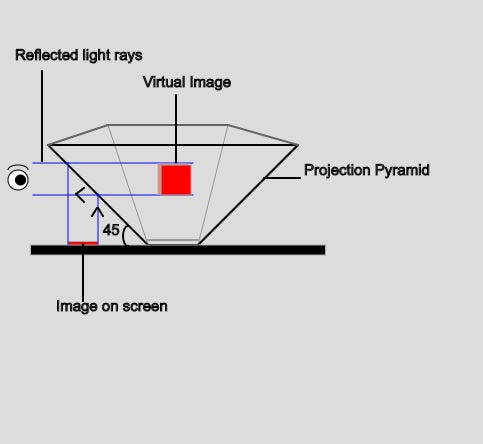

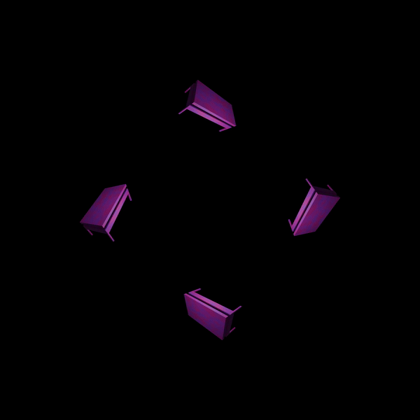

***Important note using Hologram Layout code:** If you're using a pyramid like the one in the picture above make sure to change the direction of rotation as the videos will be inverted and in consequence the hologram will be too. Inside the definition ```create_hologram_layout``` go to the loop ```for``` and change ```k=-i``` for ```k=i```.

Depending on the size of the video file that will be used as an input, the distance and size of the different videos inside the final hologram layout video will have to be changed. To do it I recommend playing around with all the following values to find the most accurate one. 

```python
    video_width, video_height = 2500, 2500  
    
    base_separation = 1000
    additional_push = 300 

    output_width = int(0.6 * video_width + 7 * base_separation + 10 * additional_push)
    output_height = int(0.6 * video_height + 7 * base_separation + 10 * additional_push)
```

To make this code fully work you'll need to have installed ```ffmpeg``` in your computer. [Here](https://formulae.brew.sh/formula/ffmpeg) you'll find the homebrew page to download it in case you have a Mac.

### *text_to_cad.py*

This file is used to properly call ZOOCAD to generate the 3D models. ***THIS FILE IS NOT OURS*** it has been taken from [Modmatrix](https://modmatrix.app/) created by Christian Ernst, you can check his repo [here](https://github.com/chris-ernst/modmatrix-ai). This file should be included in your files as it's called in ```main.py``` 

### *requirements.txt*

This file included in the repo is a text file that includes all the libraries used in the ```main.py``` python script. This file will give users an easier way to install all the libraries at once. Execute in your virtual environment the following code:

```shell
pip install -r requirements.txt
```

## - Artifact

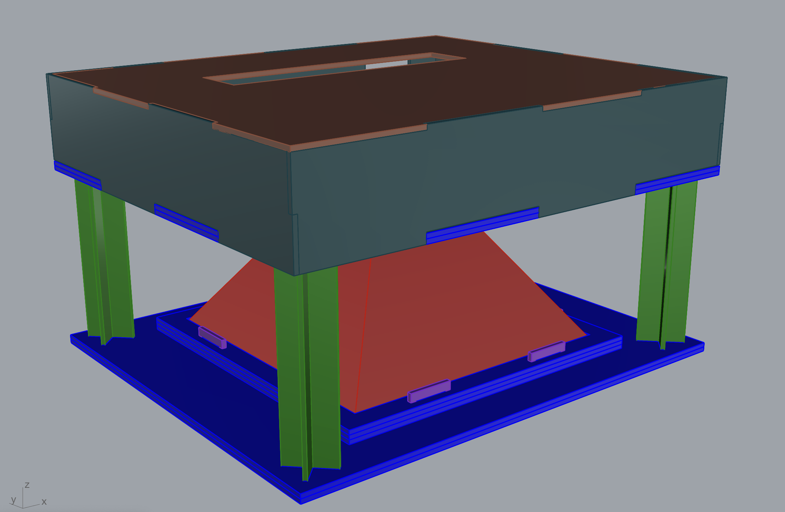

Once all the code was done, we decided to make an artifact to help us show the AI generated holograms. The box, consists of a top 'box' hiding the screen made in plywood, the pyramid made in PETG, the base also made in plywood holding the pyramid in place with different frames stuck in place by transversal unions and the columns made out of acrylic. Our screen measured 30x26 so all our files are based on that top box measure. As shown before the method for showing the holograms we used was pepper ghost projected in pyramid. For that reason, we needed to created a grasshopper script that respects the 45 degree angles and can be scaled as the user wish. 

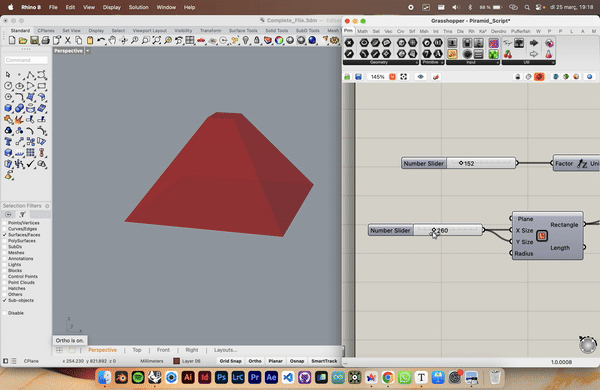

The whole artifact consists of 32 pieces + the screen. All the dxf plans are available in the folder ```CAD_FOR_HOLOGRAM```. All the unions are finger type unions so glue will only be necessary to fix them. 

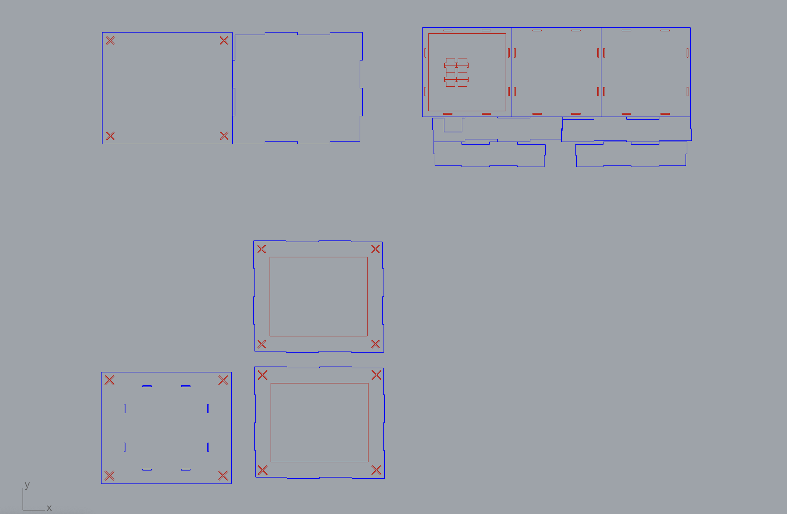

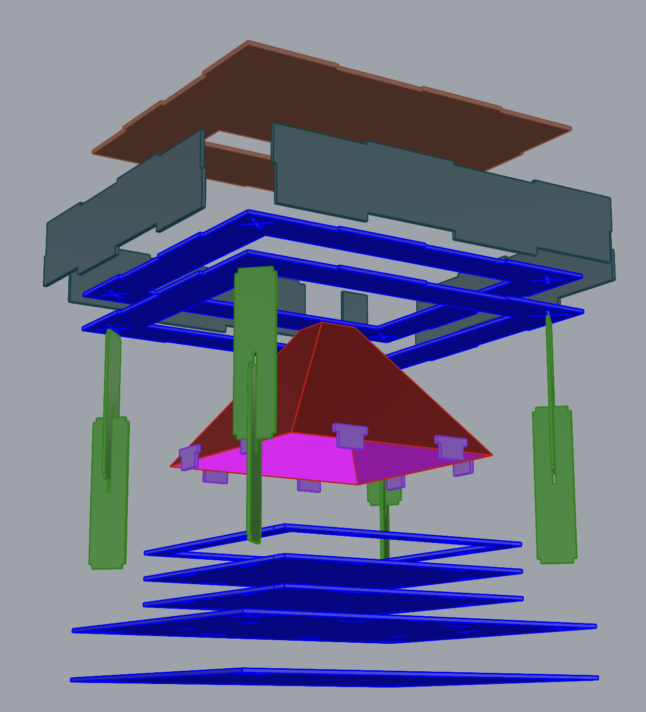

## - Final results and conclusions

We are happy with the final result but we would've love to have a newer screen to test it as the brightness wasn't that high and we could barely see it in normal conditions lightning. Even with that, our project underscores the potential of combining advanced software with hardware to create immersive visual experiences. Through a detailed instructions and a well-documented process, we provide a blueprint for others to replicate or build upon our work. This endeavor not only showcases the practical application of emerging technologies in creative industries but also highlights the importance of interdisciplinary collaboration in pushing the boundaries of what is possible.

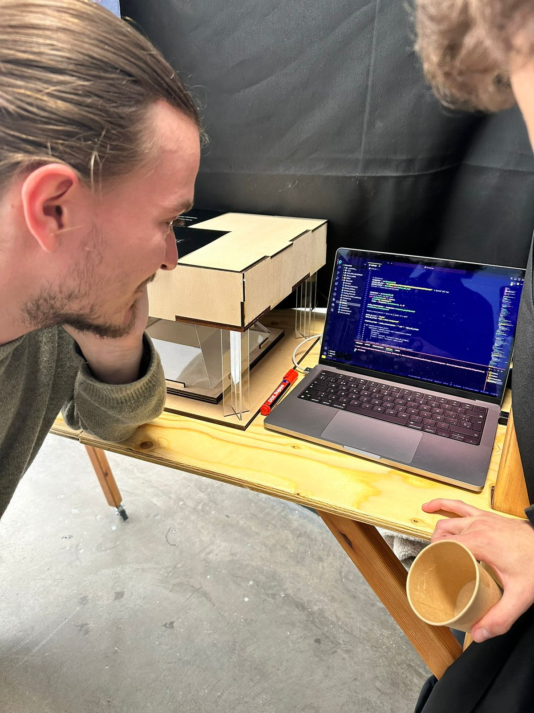


The successful execution of our project opens up new avenues for exploration in the realm of digital art, education, and entertainment, offering a glimpse into a future where ideas can be visualized in three-dimensional space with ease. As this technology continues to evolve, it holds the promise of further democratizing the creation of holographic content, making it accessible to a broader audience and inspiring the next generation of creators.

If you have any doubts or have more Ideas on how to make it better don't hesitate to reach us. We will be more than happy to talk.
